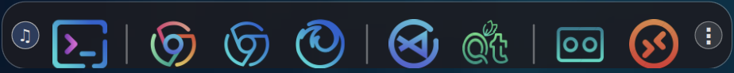
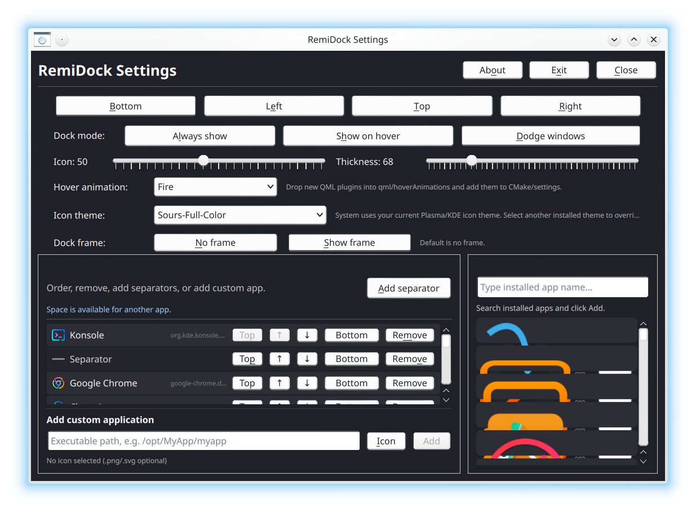

# RemiDock

A lightweight, customizable dock for **Linux Wayland desktops**, built with **Qt 6**, **QML**, and **LayerShellQt**.

RemiDock started as a modern dock project and is designed to be simple, visually appealing, and hackable. It focuses on a modern dock experience with hover effects, music-reactive icon dancing, app management from a settings window, and a codebase that is easy to extend.

---

## Screenshots

### Dock



### Settings window



---

## Features

- **Edge dock** for Linux Wayland desktops
  - Bottom / Left / Top / Right positioning
- **Dock modes**
  - Always show
  - Show on hover
  - Dodge windows
- **Pinned applications**
  - Reorder pinned items
  - Remove items
  - Add separators
  - Add installed apps from search
  - Add custom applications using an executable path + custom icon
- **Hover animations**
  - Simple
  - Zoom
  - Fire
  - Fade
- **Wave-style hover behavior**
  - Hovered icon animates fully
  - Neighboring icons animate at partial strength for a “Mexican wave” effect
- **Music mode**
  - Toggle music-reactive icon dancing
  - Audio-driven animation behavior
- **Customizable appearance**
  - Icon size
  - Dock thickness
- **Open source and hackable**
  - QML-heavy UI
  - Easy to experiment with styles and animations

---

## Tech stack

- **C++20**
- **Qt 6.4+**
- **QML / Qt Quick / Qt Quick Controls 2**
- **LayerShellQt**
- **Linux Wayland layer-shell support**
- **CMake**
- **Ninja**
- **PulseAudio / PipeWire monitor input** (for audio-reactive animation)

---

## Status

RemiDock is currently a **work in progress**.

It is usable and already includes a lot of core dock functionality, but the project is still evolving. Expect rough edges, ongoing UI polishing, and architectural improvements over time.

---

## Compatibility

RemiDock is a Linux desktop dock built around **Wayland layer-shell** behavior.

It should be considered suitable for:

- KDE Plasma Wayland
- other Linux Wayland desktop environments or compositors where LayerShellQt works correctly

It is **not Arch-only** and is **not meant to be KDE-only**, although KDE Plasma on Arch Linux is currently the main development/test environment.

X11 support is not the primary target at the moment.

---

## Build requirements

RemiDock is intended for Linux desktops/compositors that support the layer-shell protocol through LayerShellQt. It is currently developed and tested mainly on KDE Plasma, but the project is not intended to be limited to Arch Linux or KDE Plasma.

### Arch Linux / Manjaro / EndeavourOS

Install the main dependencies:

```bash
sudo pacman -S --needed \
  base-devel cmake ninja gcc extra-cmake-modules \
  qt6-base qt6-declarative qt6-svg qt6-tools qt6-imageformats \
  libxkbcommon layer-shell-qt libpulse
```

Depending on your distribution, package names may differ. You need Qt 6.4 or newer, Qt Quick/QML, Qt Quick Controls 2, Qt SVG, Qt image format plugins, LayerShellQt, CMake, Ninja, libxkbcommon, and PulseAudio/PipeWire-compatible audio tooling.


---

## Distro installer scripts

RemiDock includes explicit installer scripts for the main Linux distro families. These scripts install dependencies, configure CMake, build RemiDock, and install it system-wide under `/usr` by default.

Clone the project first:

```bash
git clone https://github.com/yousefvand/RemiDock.git
cd RemiDock
```

Then run the script for your distro:

```bash
./scripts/install-arch.sh       # Arch Linux / Manjaro / EndeavourOS
./scripts/install-fedora.sh     # Fedora
./scripts/install-ubuntu.sh     # Ubuntu
./scripts/install-debian.sh     # Debian
./scripts/install-opensuse.sh   # openSUSE Tumbleweed / Leap
./scripts/install-alpine.sh     # Alpine Linux
./scripts/install-linux.sh      # auto-detect supported distro
```

Example for Fedora:

```bash
./scripts/install-fedora.sh
```

After installation, launch RemiDock from your application launcher or run:

```bash
RemiDock
```

Installer options:

```bash
ASSUME_YES=0 ./scripts/install-fedora.sh      # ask before installing packages
SKIP_INSTALL=1 ./scripts/install-fedora.sh    # build only, do not install system-wide
INSTALL_PREFIX=/usr/local ./scripts/install-fedora.sh
SKIP_DEPS=1 ./scripts/install-fedora.sh       # skip package installation
BUILD_DIR=/tmp/remidock-build ./scripts/install-fedora.sh
BUILD_TYPE=Debug ./scripts/install-fedora.sh
```

To build a local tarball without installing to the live system:

```bash
./scripts/build-linux.sh
```

Build artifacts are written to:

```text
artifacts/
```

---

## Build

```bash
git clone https://github.com/yousefvand/RemiDock.git
cd RemiDock

cmake -S . -B build -G Ninja
cmake --build build
```

Run:

```bash
./build/bin/RemiDock
```

---

##

For Archlinux users:

```bash
yay -S remidock
```

---

## Usage

### Settings window

Use the **three-dot button** on the dock to open settings.

From the settings window you can:

- change dock position
- select dock mode
- adjust icon size
- adjust dock thickness
- choose a hover animation
- reorder pinned apps
- add separators
- add installed applications
- add custom applications

### Music mode

Use the **music button** on the opposite end of the dock to toggle music-reactive animation.

When enabled, icons can dance in response to audio activity.

---

## Hover animations

RemiDock currently ships with:

- **Simple**
- **Zoom**
- **Fire**
- **Fade**

The hover system is designed to be extended.

Animation-related QML files live in:

```text
qml/hoverAnimations/
```

The built-in animations can be used as examples for writing new ones.

---

## Adding custom applications

You can add a custom application from the settings window by providing:

- **Executable path**
- **Optional icon file** (`.png`, `.svg`, etc.)

This is useful for local binaries, AppImages, scripts, or applications without a standard desktop entry.

---

## Contributing

Contributions, ideas, bug reports, and design suggestions are welcome.

If you want to contribute:

1. Fork the repository
2. Create a feature branch
3. Make your changes
4. Open a pull request

If you are experimenting with visuals, QML hover effects, or dock behavior, feel free to open an issue first to discuss the idea.


### Alpine CI note

Alpine's minimal container image does not include `bash` by default. Use `scripts/install-alpine.sh` directly; it starts with `/bin/sh`, installs `bash` plus the Alpine Qt/KDE build dependencies, and then the normal build scripts can run.

### Ubuntu CI note

RemiDock currently requires Qt 6.4 or newer. The GitHub Actions workflow builds Ubuntu 24.04 because Ubuntu 22.04 ships older stock Qt 6 packages. If Ubuntu 22.04 support is needed, use a custom Qt installation instead of the distribution Qt packages.

